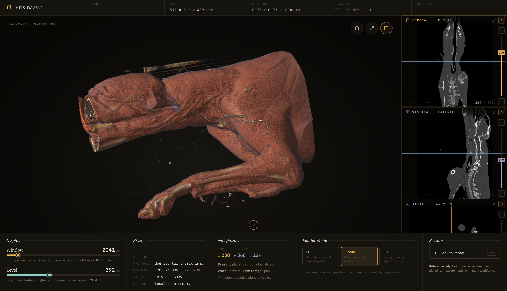
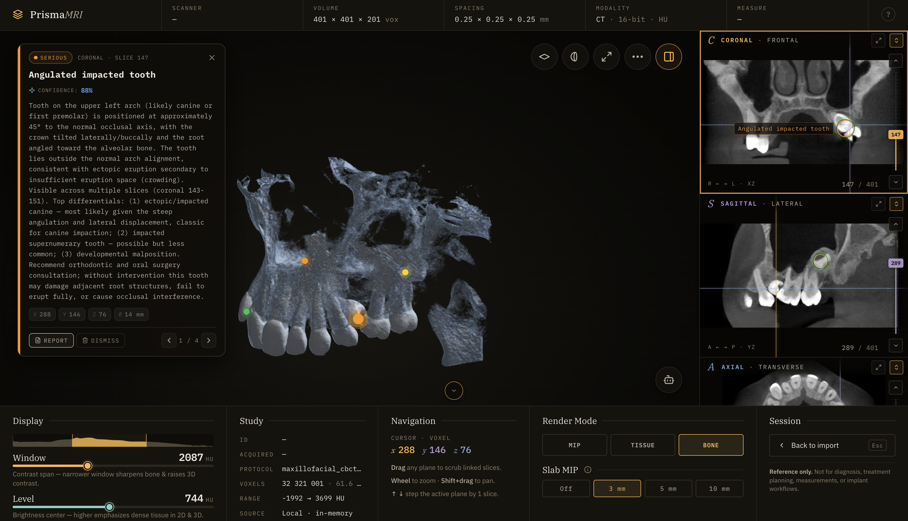

# PrismaMRI

A browser-based viewer for volumetric MRI / CT studies. All data stays on your device — no cloud, no server upload.

**Live demo:** [https://abramovychyurii.github.io/PrismaMRI/](https://abramovychyurii.github.io/PrismaMRI/)





_AI-assisted analysis via the Claude Desktop Extension — findings are pinned on both the 3D model and the 2D planes, each with a structured summary, confidence score, voxel coordinates and severity. Click **REPORT** to export them as a PDF._

## Why this project exists

After receiving my own MRI results, I only had a letter with a brief description of my condition and the findings. That was valuable for clinicians, but it did not fully satisfy my curiosity about _what was actually shown on the scans_.

I ran into a situation many patients know well:

- **No easy way to review scans on my own** — viewing the MRI visually without booking a doctor’s appointment was difficult.
- **Limited time during visits** — the doctor rarely had time to go through the images in detail with me.
- **Clunky clinical software UX** — a Windows desktop app focused on **a single plane with a 2D slice**, which is hard to interpret without medical training.

So I built a **simpler way to review results for personal use**: three orthogonal slices at once, a synchronized cursor, and a 3D volume overview — in a normal browser.

> **Important:** PrismaMRI is for **personal exploration and learning**, not a medical device. It **does not diagnose** and **does not replace** a physician’s consultation or an official radiology report.

## Features

### Viewing & navigation

- **3D volumetric view** — real-time GPU rendering of the full volume with orbit, zoom and pan.
- **Three synchronized 2D planes** — coronal, sagittal and axial panels share a single 3D crosshair. Click any panel to focus it; the cursor stays in sync across all four views (including 3D).
- **Three render modes** for the 3D view:
  - **MIP** — maximum-intensity projection across the full scalar range; great as a general overview.
  - **Tissue** — soft-tissue lookup highlighting fat, muscle, fluid and marrow.
  - **Bone** — emphasises dense, bright structures (skeleton, dental, CBCT).
- **Slice planes in 3D** — overlay the active slice (or all three) directly on the 3D model. Optionally clip the volume at the active slice for a cutaway view.
- **Focus / fullscreen mode** — expand any 2D panel to fullscreen, or hide all chrome and focus on the 3D stage alone.
- **“View from this side”** — right-click a 2D panel to snap the 3D camera to that plane’s orientation.
- **Slab MIP** — render a 3 / 5 / 10 mm thick max-intensity slab on the 2D panels for thicker lesions and vessels.
- **Window / Level** — separate live-draft and committed values; bound to a histogram with WL bracket overlay so you can see what tissue your contrast settings cover.
- **Slice scrubber** — vertical scrubber per panel; scroll-wheel, `↑ / ↓`, `PgUp / PgDn`, `Home / End` and touch-swipe all step through slices.
- **Measurement tool** — pick two points on any plane and read the 3D Euclidean distance in millimetres (uses the volume’s real voxel spacing).
- **Per-slice PNG export** — download the current slice (with overlays) as a PNG.

### AI assistance (optional)

- **Claude Desktop Extension** — ship-as-`.dxt` MCP server lets Claude operate the viewer end-to-end: navigate, capture, window/level, render presets, slab MIP, annotations, measurements.
- **Embedded radiology skill** — every `.dxt` carries an evidence-based prompt ([`mcp-server/skill/SKILL.md`](mcp-server/skill/SKILL.md)) with RSNA-style structured reports and a MIP-first, three-plane confirmation protocol — delivered to Claude automatically via the MCP `initialize` handshake.
- **AI annotations on the volume** — the agent places severity-coloured pins on the 2D panels _and_ the 3D model (critical / serious / moderate / note), with a label, summary, confidence score and optional size.
- **Findings HUD** — floating card per finding with severity chip, location, confidence bar, summary, voxel coordinates and prev/next navigation. Click a pin to focus its finding.
- **PDF report generation** — export findings to a printable PDF with:
  - scope toggle (this finding only vs all findings + consolidated impression),
  - optional scan thumbnails captured from the exact slice of each finding,
  - optional finding markers drawn on those thumbnails,
  - automatic page-break layout, volume metadata header, AI confidence and disclaimer.
- **Demo report** — a pre-recorded AI analysis ships with the bundled examples (Maxilla CBCT), so the full pipeline can be previewed without installing the extension.

### Privacy & UX

- **Local-only processing** — parsing runs in a Web Worker; the volume lives in RAM for the session and is dropped when the tab closes.
- **PWA installable** — runs offline once installed; Claude Desktop then connects to the installed PWA directly via local WebSocket (no relay).
- **Mobile layout** — dedicated bottom tab bar, touch-swipe slice navigation, single-plane focus mode.
- **Folder import / drag-and-drop** — drop a DICOM folder, a `.nii.gz`, a `.mha/.mhd`, a `.nrrd`, or a ZIP archive containing any of those.
- **IndexedDB cache** — the last loaded volume is restored on reload so you don’t re-import on every refresh.
- **Per-volume annotation persistence** — AI findings are stored per volume in `localStorage` and reattach automatically when the same volume is reopened.
- **Keyboard shortcuts** — `?` opens a full shortcuts cheat-sheet; `⌘O` / `Ctrl+O` opens folder, `Esc` returns to import.

## Supported formats

| Format    | Extensions / notes                          |
| --------- | ------------------------------------------- |
| DICOM     | Folder of `.dcm` files (slice series)       |
| NIfTI     | `.nii`, `.nii.gz`                           |
| MetaImage | `.mha`, `.mhd`                              |
| NRRD      | `.nrrd`, `.nhdr`                            |
| ZIP       | Archive containing any of the formats above |

## Example data

Sample volumes live in [`examples/`](examples/) (~450 MB total). Files over GitHub’s 100 MB limit are stored with **Git LFS**. After cloning:

```bash
git lfs install
git lfs pull
```

| File | Description | Source |
|------|-------------|--------|
| [`examples/maxillofacial_CBCT.nrrd`](examples/maxillofacial_CBCT.nrrd) | Maxillofacial CBCT (~32 MB) — ships with a pre-recorded AI demo report | **[Tamas Bistey](https://www.embodi3d.com/)** — [CT scan](https://www.embodi3d.com/files/file/61544-ct-scan/) |
| [`examples/dog_frontal_thorax_injured_paw_CT.nrrd`](examples/dog_frontal_thorax_injured_paw_CT.nrrd) | Dog frontal thorax CT, injured paw (~131 MB) | **[Gagghi](https://www.embodi3d.com/profile/27661-gagghi/)** — [gomito](https://www.embodi3d.com/files/file/60671-gomito/) |
| [`examples/full_body.nrrd`](examples/full_body.nrrd) | Full-body CT (~290 MB) | **[Laci](https://www.embodi3d.com/profile/35743-laci/)** — [Laci-Body-1](https://www.embodi3d.com/files/file/43471-laci-body-1/) |

After `npm run dev`, drag a file onto the import screen or use **Open file**. See [`examples/README.md`](examples/README.md) for attribution.

## Quick start

**Requirements:** Node.js 18+

```bash
npm install
npm run dev
```

Open the URL printed in the terminal (usually http://localhost:5173).

### Other commands

```bash
npm run build      # production build (web + bundled DXT server)
npm run package:dxt # build a standalone prismamri.dxt for Claude Desktop
npm run preview    # preview production build
npm run lint       # Biome check
npm run typecheck
npm run test:e2e   # Playwright end-to-end tests
```

## How to use

1. Start the app and on the import screen **drag a folder** of DICOM files or a study file.
2. Or click **Open folder** / **Open file** (or `⌘O` / `Ctrl+O` for a folder).
3. Click a slice panel to set the active plane; scroll with the mouse wheel or `↑` / `↓` to step through slices.
4. Adjust **Window** and **Level** in the Display panel; switch render mode (MIP / Tissue / Bone) in the Render panel.
5. Right-click a slice panel for the measurement menu (`Set start` → `Set end`, or `View from this side` to align 3D).
6. Press `?` for the full keyboard shortcut sheet; `Esc` returns to the import screen.

## AI-assisted analysis (optional)

PrismaMRI ships a Claude Desktop Extension (`prismamri.dxt`) that lets Claude navigate the viewer, capture slices, place annotations, run measurements, and produce a structured description of the study.

For materially better analysis quality, every `prismamri.dxt` ships with an embedded evidence-based skill prompt — **[`mcp-server/skill/SKILL.md`](mcp-server/skill/SKILL.md)**. It encodes systematic CT/MRI search patterns, an RSNA-style structured report template, and a tool-orchestration recipe derived from peer-reviewed studies on multimodal-LLM performance in radiology (2024–2025).

The skill is bundled inside the `.dxt` archive and delivered to Claude automatically via the MCP `initialize` handshake (`instructions` field) — there is nothing to install or configure. As soon as you connect the extension in Claude Desktop, the methodology is active. Compared to an unguided prompt, this noticeably improves descriptive accuracy and reduces hallucinated findings.

Once findings appear in the viewer, click **REPORT** on any finding card to export a fully formatted PDF (single finding or full study), with optional scan thumbnails and severity-coloured markers drawn directly on the captures.

> The skill is for **personal exploration and learning**, not a medical device. It does not diagnose and does not replace a physician's consultation or an official radiology report.

## Privacy

- Data is **never sent** to a server.
- No analytics or telemetry in the app itself.
- Closing the tab clears the volume from browser memory (the IndexedDB cache is per-origin and clears with browser data).
- The Claude extension connects directly to the viewer over loopback WebSocket — no relay, works offline.

Obtain imaging only through official channels (clinic, PACS, media handoff) and follow local laws on personal health data.

## Tech stack

- [React](https://react.dev/) + [TypeScript](https://www.typescriptlang.org/)
- [Vite](https://vitejs.dev/) + [vite-plugin-pwa](https://vite-pwa-org.netlify.app/) (PWA / offline support)
- [Three.js](https://threejs.org/) — 3D viewing
- [Zustand](https://github.com/pmndrs/zustand) — UI state
- [styled-components](https://styled-components.com/) — styling
- [jsPDF](https://github.com/parallax/jsPDF) — report export
- Web Workers — parsing large volumes off the main thread
- MCP (Model Context Protocol) — Claude Desktop bridge

## License

PrismaMRI is released under the [MIT License](LICENSE).
